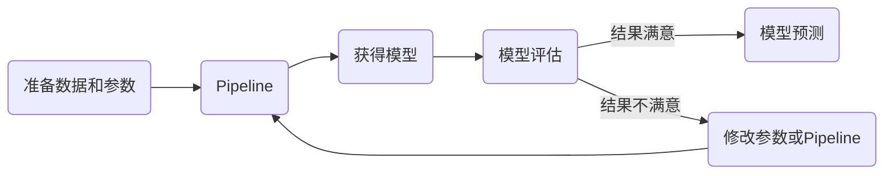

# 说明

为了实现高效的模型训练pipeline，本人将常用的文本分类数据处理方法、特征工程及模型封装为可被pipeline传输的函数，方便大家以pipeline的形式进行文本分类模型的训练。以下是支持的函数列表。有些模型因为时间原因并没有完全实现词向量层的灵活配置。大家可根据自己需要对代码进行修改。

训练架构：



关于数据处理部分，大家可以参考.ipynb文件。

关于函数的pipeline工作顺序，如下：


## 函数

| 函数类目               | 函数                                                 | 编号    |
| ---------------------- | ---------------------------------------------------- | ------- |
| Augment                | cda.aug_simword                                      | A1-1    |
| Augment                | cda.aug_nerword                                      | A1-2    |
| Augment                | cda.aug_simchar                                      | A1-3    |
| Augment                | cda.aug_delechar                                     | A1-4    |
| Augment                | cda.aug_exchangechar                                 | A1-5    |
| Augment                | cda.aug_equchar                                      | A1-6    |
| Augment                | cda.aug_backtrans                                    | A1-7    |
| TextPreprocess         | typeface_transform.char_converter                    | TP1     |
| TextPreprocess         | cut_word.jieba_cut                                   | TP2-1   |
| TextPreprocess         | cut_word.thulac_cut                                  | TP2-2   |
| TextPreprocess         | cut_word.pkuseg_cut                                  | TP2-3   |
| TextPreprocess         | cut_word.lac_cut                                     | TP2-4   |
| TextPreprocess         | cut_word.ltp_cut                                     | TP2-5   |
| TextPreprocess         | cut_word.snow_cut                                    | TP2-6   |
| TextPreprocess         | chartype_filter.number_filter                        | TP3     |
| TextPreprocess         | n_gram.word_ngrams                                   | TP4     |
| ExtractKeyword         | tf_idf.jieba_tfidf                                   | EK1-1   |
| ExtractKeyword         | tf_idf.define_tfidf                                  | EK1-2   |
| ExtractKeyword         | text_rank.jieba_textrank                             | EK1-3   |
| TextVector             | traditional_vector.one_hot                           | TV1-1   |
| TextVector             | traditional_vector.one_hot_keras                     | TV1-2   |
| TextVector             | traditional_vector.count_vector                      | TV1-3   |
| TextVector             | traditional_vector.hash_vector                       | TV1-4   |
| TextVector             | traditional_vector.tfidf_vector                      | TV1-5   |
| TextVector             | word_embedding.word2vector                           | TV2-1   |
| TextVector             | word_embedding.tencent_w2v                           | TV2-2   |
| TextVector             | word_embedding.co_occurrence                         | TV2-3   |
| TextVector             | word_embedding.lsa_vec                               | TV2-4   |
| TextVector             | word_embedding_process.wordvec_sum                   | TV3-1   |
| TextVector             | word_embedding_process.wordvec_avg                   | TV3-2   |
| TextVector             | word_embedding_process.wordvec_sif_avg               | TV3-3   |
| TextVector             | word_embedding_process.wordvec_usif_avg              | TV3-4   |
| TextVector             | word_embedding_process.wordvec_tfidf_avg             | TV3-5   |
| TextVector             | word_embedding_process.wordvec_index                 | TV3-6   |
| TextVector             | sentence_embedding.doc2vector                        | TV4-1   |
| TextVector             | sentence_embedding.bert_cls                          | TV4-2   |
| FeatureDimensionReduce | feature_filter.variance_filter                       | FD-1    |
| FeatureDimensionReduce | feature_concentration.linear.pca                     | FD-2-1  |
| FeatureDimensionReduce | feature_concentration.linear.increment_pca           | FD-2-2  |
| FeatureDimensionReduce | feature_concentration.linear.kernel_pca              | FD-2-3  |
| FeatureDimensionReduce | feature_concentration.linear.sparse_pca              | FD-2-4  |
| FeatureDimensionReduce | feature_concentration.linear.minibatch_pca           | FD-2-5  |
| FeatureDimensionReduce | feature_concentration.linear.factor_analysis         | FD-2-6  |
| FeatureDimensionReduce | feature_concentration.linear.svd                     | FD-2-7  |
| FeatureDimensionReduce | feature_concentration.linear.truncated_svd           | FD-2-8  |
| FeatureDimensionReduce | feature_concentration.linear.lda                     | FD-2-9  |
| FeatureDimensionReduce | feature_concentration.linear.fast_ica                | FD-2-10 |
| FeatureDimensionReduce | feature_concentration.linear.nmf                     | FD-2-11 |
| FeatureDimensionReduce | feature_concentration.nonlinear.isomap               | FD-3-1  |
| FeatureDimensionReduce | feature_concentration.nonlinear.mds                  | FD-3-2  |
| FeatureDimensionReduce | feature_concentration.nonlinear.t_sne                | FD-3-3  |
| FeatureDimensionReduce | feature_concentration.nonlinear.lle                  | FD-3-4  |
| FeatureCode            | feature_normlization.stand_scaler                    | FC-1    |
| FeatureCode            | feature_switch.randomtrees_embedding                 | FC-2    |
| ModelPreparation       | dataset_partition.split_train_test                   | MP-1    |
| ModelPreparation       | noise_cleaning.edite_nearest_neighbours              | MP-2-1  |
| ModelPreparation       | noise_cleaning.all_knn                               | MP-2-2  |
| ModelPreparation       | noise_cleaning.onesided_selection                    | MP-2-3  |
| ModelPreparation       | noise_cleaning.neighbourhood_cleaningrule            | MP-2-4  |
| ModelPreparation       | sampling.over_sampling.random_over_sampling          | MP-3-1  |
| ModelPreparation       | sampling.over_sampling.smote                         | MP-3-2  |
| ModelPreparation       | sampling.over_sampling.borderline_smote              | MP-3-3  |
| ModelPreparation       | sampling.over_sampling.smotenc                       | MP-3-4  |
| ModelPreparation       | sampling.over_sampling.svm_smote                     | MP-3-5  |
| ModelPreparation       | sampling.over_sampling.kmeans_smote                  | MP-3-6  |
| ModelPreparation       | sampling.over_sampling.adasyn                        | MP-3-7  |
| ModelPreparation       | sampling.under_sampling.cluster_centroids            | MP-4-1  |
| ModelPreparation       | sampling.under_sampling.random_under_sampling        | MP-4-2  |
| ModelPreparation       | sampling.under_sampling.near_miss                    | MP-4-3  |
| ModelPreparation       | sampling.combine_sampling.smote_enn                  | MP-5-1  |
| ModelPreparation       | sampling.combine_sampling.smote_tomek                | MP-5-2  |
| Classifier             | baseline.dummy                                       | C1      |
| Classifier             | machine_learning.knn.knn_kd                          | C2-1-1  |
| Classifier             | machine_learning.knn.knn_radius                      | C2-1-2  |
| Classifier             | machine_learning.naive_bayes.complement_nb           | C2-2-1  |
| Classifier             | machine_learning.naive_bayes.bernoulli_nb            | C2-2-2  |
| Classifier             | machine_learning.naive_bayes.multinomial_nb          | C2-2-3  |
| Classifier             | machine_learning.discriminant.liner_discriminant     | C2-3-1  |
| Classifier             | machine_learning.discriminant.quadratic_discriminant | C2-3-2  |
| Classifier             | machine_learning.linear_model.ridge                  | C2-4-1  |
| Classifier             | machine_learning.linear_model.logistic_regression    | C2-4-2  |
| Classifier             | machine_learning.linear_model.sgd                    | C2-4-3  |
| Classifier             | machine_learning.tree.decision_tree                  | C2-5-1  |
| Classifier             | machine_learning.tree.extra_tree                     | C2-5-2  |
| Classifier             | machine_learning.svm.c_svm                           | C2-6-1  |
| Classifier             | machine_learning.svm.nu_svm                          | C2-6-2  |
| Classifier             | machine_learning.svm.linear_svm                      | C2-6-3  |
| Classifier             | machine_learning.other.gaussian_process              | C2-7-1  |
| Classifier             | ensemble_learning.boosting.ada_boost                 | C3-1-1  |
| Classifier             | ensemble_learning.boosting.gbdt                      | C3-1-2  |
| Classifier             | ensemble_learning.boosting.hist_gbdt                 | C3-1-3  |
| Classifier             | ensemble_learning.boosting.xgboost                   | C3-1-4  |
| Classifier             | ensemble_learning.boosting.light_gbm                 | C3-1-5  |
| Classifier             | ensemble_learning.boosting.cat_boost                 | C3-1-6  |
| Classifier             | ensemble_learning.trees.extra_trees                  | C3-2-1  |
| Classifier             | ensemble_learning.trees.random_forest                | C3-2-2  |
| Classifier             | deep_learning.train.mlp                              | C4-1-1  |
| Classifier             | deep_learning.train.dnn                              | C4-1-2  |
| Classifier             | deep_learning.train.fast_text                        | C4-1-3  |
| Classifier             | deep_learning.train.dan                              | C4-1-4  |
| Classifier             | deep_learning.train.swem                             | C4-1-5  |
| Classifier             | deep_learning.train.lenet_5                          | C4-2-1  |
| Classifier             | deep_learning.train.text_cnn                         | C4-2-2  |
| Classifier             | deep_learning.train.text_dcnn                        | C4-2-3  |
| Classifier             | deep_learning.train.text_inception                   | C4-2-4  |
| Classifier             | deep_learning.train.dpcnn                            | C4-2-5  |
| Classifier             | deep_learning.train.text_vdcnn                       | C4-2-6  |
| Classifier             | deep_learning.train.simple_rnn                       | C4-3-1  |
| Classifier             | deep_learning.train.lstm                             | C4-3-2  |
| Classifier             | deep_learning.train.bi_lstm                          | C4-3-3  |
| Classifier             | deep_learning.train.gru                              | C4-3-4  |
| Classifier             | deep_learning.train.bi_gru                           | C4-3-5  |
| Classifier             | deep_learning.train.rcnn                             | C4-4-1  |
| Classifier             | deep_learning.train.clstm                            | C4-4-2  |
| Classifier             | deep_learning.train.para_clstm                       | C4-4-3  |
| Classifier             | deep_learning.train.bilstm_attention                 | C4-5-1  |
| Classifier             | deep_learning.train.self_attention                   | C4-5-2  |
| Classifier             | deep_learning.train.bilstm_selfattention             | C4-5-3  |
| Classifier             | transfer_learning.train.bert_finetuning              | C5-1-1  |

| 函数类目说明 | 函数说明                          | 编号    |
| ------------ | --------------------------------- | ------- |
| 数据增强     | 随机同义词替换                    | A1-1    |
| 数据增强     | 随机等价实体替换                  | A1-2    |
| 数据增强     | 随机近义字替换                    | A1-3    |
| 数据增强     | 随机字删除                        | A1-4    |
| 数据增强     | 随机置换邻近字                    | A1-5    |
| 数据增强     | 等价字替换                        | A1-6    |
| 数据增强     | 文本回译                          | A1-7    |
| 文本预处理   | 繁简体转换                        | TP1     |
| 文本预处理   | jieba分词                         | TP2-1   |
| 文本预处理   | thulac分词                        | TP2-2   |
| 文本预处理   | pkuseg分词                        | TP2-3   |
| 文本预处理   | lac分词                           | TP2-4   |
| 文本预处理   | ltp分词                           | TP2-5   |
| 文本预处理   | snowNLP分词                       | TP2-6   |
| 文本预处理   | 数字过滤                          | TP3     |
| 文本预处理   | n-gram                            | TP4     |
| 关键词提取   | jieba TFIDF                       | EK1-1   |
| 关键词提取   | 自定义TFIDF                       | EK1-2   |
| 关键词提取   | TextRank                          | EK1-3   |
| 文本表征     | 传统one-hot                       | TV1-1   |
| 文本表征     | 深度学习one-hot                   | TV1-2   |
| 文本表征     | count-vector                      | TV1-3   |
| 文本表征     | hash-vector                       | TV1-4   |
| 文本表征     | TFIDF-vector                      | TV1-5   |
| 文本表征     | word2vector                       | TV2-1   |
| 文本表征     | 腾讯预训练w2v                     | TV2-2   |
| 文本表征     | 共现矩阵                          | TV2-3   |
| 文本表征     | LSA                               | TV2-4   |
| 文本表征     | 求和                              | TV3-1   |
| 文本表征     | 平均                              | TV3-2   |
| 文本表征     | sif加权平均                       | TV3-3   |
| 文本表征     | usif加权平均                      | TV3-4   |
| 文本表征     | TFIDF加权平均                     | TV3-5   |
| 文本表征     | word2vec权重矩阵index生成         | TV3-6   |
| 文本表征     | doc2vec                           | TV4-1   |
| 文本表征     | Bert CLS句向量                    | TV4-2   |
| 特征降维     | 特征筛选-方差滤波器               | FD-1    |
| 特征降维     | PCA                               | FD-2-1  |
| 特征降维     | 增量PCA                           | FD-2-2  |
| 特征降维     | 核PCA                             | FD-2-3  |
| 特征降维     | 稀疏PCA                           | FD-2-4  |
| 特征降维     | 小批量PCA                         | FD-2-5  |
| 特征降维     | 因子分析                          | FD-2-6  |
| 特征降维     | SVD                               | FD-2-7  |
| 特征降维     | 截断SVD                           | FD-2-8  |
| 特征降维     | LDA                               | FD-2-9  |
| 特征降维     | Fast-ICA                          | FD-2-10 |
| 特征降维     | NMF                               | FD-2-11 |
| 特征降维     | Isomap                            | FD-3-1  |
| 特征降维     | MDS                               | FD-3-2  |
| 特征降维     | T-SNE                             | FD-3-3  |
| 特征降维     | LLE                               | FD-3-4  |
| 特征编码     | 标准差标准化                      | FC-1    |
| 特征编码     | 随机森林嵌入                      | FC-2    |
| 模型准备     | 数据拆分                          | MP-1    |
| 模型准备     | 最近邻ENN降噪                     | MP-2-1  |
| 模型准备     | AllKNN降噪                        | MP-2-2  |
| 模型准备     | One-Sided Selection降噪           | MP-2-3  |
| 模型准备     | NeighbourhoodCleaningRule降噪     | MP-2-4  |
| 模型准备     | 随机过采样                        | MP-3-1  |
| 模型准备     | SMOTE过采样                       | MP-3-2  |
| 模型准备     | Borderline SMOTE过采样            | MP-3-3  |
| 模型准备     | SMOTENC过采样                     | MP-3-4  |
| 模型准备     | SVM-SMOTE过采样                   | MP-3-5  |
| 模型准备     | KMeans-SMOTE过采样                | MP-3-6  |
| 模型准备     | ADASYN过采样                      | MP-3-7  |
| 模型准备     | ClusterCentroids欠采样            | MP-4-1  |
| 模型准备     | 随机欠采样                        | MP-4-2  |
| 模型准备     | NearMiss启发欠采样                | MP-4-3  |
| 模型准备     | SMOTEENN                          | MP-5-1  |
| 模型准备     | SMOTETomek                        | MP-5-2  |
| 分类模型     | 随机基线分类器                    | C1      |
| 分类模型     | KNN-KD树                          | C2-1-1  |
| 分类模型     | KNN-球树                          | C2-1-2  |
| 分类模型     | 补充朴素贝叶斯                    | C2-2-1  |
| 分类模型     | 伯努利朴素贝叶斯                  | C2-2-2  |
| 分类模型     | 多项式朴素贝叶斯                  | C2-2-3  |
| 分类模型     | 线性判别分析                      | C2-3-1  |
| 分类模型     | 二次判别分析                      | C2-3-2  |
| 分类模型     | 岭回归                            | C2-4-1  |
| 分类模型     | Logistic回归                      | C2-4-2  |
| 分类模型     | 随机梯度下降分类器集合            | C2-4-3  |
| 分类模型     | 决策树                            | C2-5-1  |
| 分类模型     | 极限随机树                        | C2-5-2  |
| 分类模型     | 支持向量机(基于libsvm)            | C2-6-1  |
| 分类模型     | Nu支持向量机(基于libsvm)          | C2-6-2  |
| 分类模型     | 线性支持向量机                    | C2-6-3  |
| 分类模型     | 高斯过程                          | C2-7-1  |
| 分类模型     | AdaBoost                          | C3-1-1  |
| 分类模型     | 梯度提升树(GBDT)                  | C3-1-2  |
| 分类模型     | 直方图梯度提升树Hist-GBDT         | C3-1-3  |
| 分类模型     | XGBoost                           | C3-1-4  |
| 分类模型     | LightGBM                          | C3-1-5  |
| 分类模型     | CatBoost                          | C3-1-6  |
| 分类模型     | 极限随机森林                      | C3-2-1  |
| 分类模型     | 随机森林                          | C3-2-2  |
| 分类模型     | MLP                               | C4-1-1  |
| 分类模型     | DNN                               | C4-1-2  |
| 分类模型     | fastText                          | C4-1-3  |
| 分类模型     | DAN                               | C4-1-4  |
| 分类模型     | Simple Word-embedding Model(SWEM) | C4-1-5  |
| 分类模型     | LeNet-5                           | C4-2-1  |
| 分类模型     | textCNN                           | C4-2-2  |
| 分类模型     | textDCNN                          | C4-2-3  |
| 分类模型     | textInception                     | C4-2-4  |
| 分类模型     | DPCNN                             | C4-2-5  |
| 分类模型     | textVDCNN                         | C4-2-6  |
| 分类模型     | Simple-RNN                        | C4-3-1  |
| 分类模型     | LSTM                              | C4-3-2  |
| 分类模型     | BiLSTM                            | C4-3-3  |
| 分类模型     | GRU                               | C4-3-4  |
| 分类模型     | BiGRU                             | C4-3-5  |
| 分类模型     | RCNN                              | C4-4-1  |
| 分类模型     | C-LSTM                            | C4-4-2  |
| 分类模型     | para-CLSTM                        | C4-4-3  |
| 分类模型     | Attention                         | C4-5-1  |
| 分类模型     | Self-Attention                    | C4-5-2  |
| 分类模型     | BiLSTM Self-Attention             | C4-5-3  |
| 分类模型     | Bert FineTuning                   | C5-1-1  |

# pipeline 函数组合示例

## 词袋模型+经典机器学习

```python
# 繁体转简体
TextPreprocess.typeface_transform.char_converter
# jieba分词
TextPreprocess.cut_word.jieba_cut
# int和float类型词过滤
TextPreprocess.chartype_filter.number_filter
# count_vector
TextVector.traditional_vector.count_vector
# PCA降维
FeatureDimensionReduce.feature_concentration.linear.pca
# 标准差归一化
FeatureCode.feature_normlization.stand_scaler
# 数据拆分
ModelPreparation.dataset_partition.split_train_test

# 以下模型方法可任选其一
# 多项式朴素贝叶斯
Classifier.machine_learning.naive_bayes.multinomial_nb
# 决策树
Classifier.machine_learning.tree.decision_tree
# LightGBM
Classifier.ensemble_learning.boosting.light_gbm
# 随机森林
Classifier.ensemble_learning.trees.random_forest
```

## embedding+经典机器学习

```python
# 繁体转简体
TextPreprocess.typeface_transform.char_converter
# jieba分词
TextPreprocess.cut_word.jieba_cut
# int和float类型词过滤
TextPreprocess.chartype_filter.number_filter
# word embedding
TextVector.word_embedding.word2vector
# word embedding tfidf加权平均得到doc vector
TextVector.word_embedding_process.wordvec_tfidf_avg
# PCA降维（可以没有这一步）
FeatureDimensionReduce.feature_concentration.linear.pca
# 标准差归一化（看分类器类型，也可以没有这一步）
FeatureCode.feature_normlization.stand_scaler
# 数据拆分
ModelPreparation.dataset_partition.split_train_test

# 以下模型方法可任选其一
# Logistic回归
Classifier.machine_learning.linear_model.logistic_regression
# SVM
Classifier.machine_learning.svm.c_svm
# XGBoost
Classifier.ensemble_learning.boosting.xgboost
# MLP
Classifier.deep_learning.train.mlp
```

## Simple word-embedding Model（SWEM）

```python
# 设置池化方法为层次池化方法"hierarchical",还可设置"max","avg","concat"
input_data['Classifier']['deep_learning']['swem']['pooling_type'] = 'hierarchical'
# 繁体转简体
TextPreprocess.typeface_transform.char_converter
# jieba分词
TextPreprocess.cut_word.jieba_cut
# int和float类型词过滤
TextPreprocess.chartype_filter.number_filter
# one-hot编码
TextVector.traditional_vector.one_hot_keras
# 数据拆分
ModelPreparation.dataset_partition.split_train_test
# Simple word-embedding Model（SWEM）模型训练
Classifier.deep_learning.train.swem
```

## 加载预训练词向量矩阵的模型

```python
# 繁体转简体
TextPreprocess.typeface_transform.char_converter
# jieba分词
TextPreprocess.cut_word.jieba_cut
# int和float类型词过滤
TextPreprocess.chartype_filter.number_filter
# one-hot编码
TextVector.traditional_vector.one_hot_keras
# 加载腾讯word2vec预训练词向量
TextVector.word_embedding.tencent_w2v
# 构建word2cec词向量权重矩阵
TextVector.word_embedding_process.wordvec_index
# 数据拆分
ModelPreparation.dataset_partition.split_train_test

# 以下模型方法可任选其一
# textCNN
Classifier.deep_learning.train.text_cnn
# DPCNN
Classifier.deep_learning.train.dpcnn
```

## 不加载预训练词向量矩阵的模型

```python
# 繁体转简体
TextPreprocess.typeface_transform.char_converter
# jieba分词
TextPreprocess.cut_word.jieba_cut
# int和float类型词过滤
TextPreprocess.chartype_filter.number_filter
# one-hot编码
TextVector.traditional_vector.one_hot_keras
# 数据拆分
ModelPreparation.dataset_partition.split_train_test

# 以下模型方法可任选其一
# fastText
Classifier.deep_learning.train.fast_text
# DAN
Classifier.deep_learning.train.dan
# LeNet-5
Classifier.deep_learning.train.lenet_5
# textInception
Classifier.deep_learning.train.text_inception
# simpleRNN
Classifier.deep_learning.train.simple_rnn
# LSTM
Classifier.deep_learning.train.lstm
# BiLSTM
Classifier.deep_learning.train.bi_lstm
# GRU
Classifier.deep_learning.train.gru
# BiGRU
Classifier.deep_learning.train.bi_gru
# textRCNN
Classifier.deep_learning.train.rcnn
# C-LSTM
Classifier.deep_learning.train.clstm
# para-CLSTM
Classifier.deep_learning.train.para_clstm
# BiLSTM+Attention
Classifier.deep_learning.train.bilstm_attention
# Self-Attention+GlobalAveragePooling
Classifier.deep_learning.train.self_attention
# BiLSTM+Self-Attention
Classifier.deep_learning.train.bilstm_selfattention
```

## textDCNN

```python
# 设置池化方法为层次池化方法"hierarchical",还可设置"max","avg","concat"
input_data['Classifier']['deep_learning']['text_dcnn']['filters_list'] = [[2, 3, 4], [3, 4, 5]]
# 繁体转简体
TextPreprocess.typeface_transform.char_converter
# jieba分词
TextPreprocess.cut_word.jieba_cut
# int和float类型词过滤
TextPreprocess.chartype_filter.number_filter
# one-hot编码
TextVector.traditional_vector.one_hot_keras
# 数据拆分
ModelPreparation.dataset_partition.split_train_test
# textDCNN
Classifier.deep_learning.train.text_dcnn
```

## textVDCNN

```python
# 设置池化方法为层次池化方法"hierarchical",还可设置"max","avg","concat"
input_data['Classifier']['deep_learning']['text_vdcnn']['init_filters'] = 64
input_data['Classifier']['deep_learning']['text_vdcnn']['blocks'] = [2, 2, 2, 2]
# 繁体转简体
TextPreprocess.typeface_transform.char_converter
# jieba分词
TextPreprocess.cut_word.jieba_cut
# int和float类型词过滤
TextPreprocess.chartype_filter.number_filter
# one-hot编码
TextVector.traditional_vector.one_hot_keras
# 数据拆分
ModelPreparation.dataset_partition.split_train_test
# textVDCNN
Classifier.deep_learning.train.text_vdcnn
```


## Bert embedding+DNN

```python
# 对原始数据进行cls句向量的加载
TextVector.sentence_embedding.bert_cls  
# 数据拆分
ModelPreparation.dataset_partition.split_train_test 
# DNN模型训练
Classifier.deep_learning.train.dnn  
```

## Bert微调

```python
# 配置数据拆分模块接收原始数据拆分
input_data['parameter']['ModelPreparation']['split_train_test']['is_original_data'] = 1
# 数据拆分
ModelPreparation.dataset_partition.split_train_test
# tokenizer和tensor数据加载
ModelPreparation.tokenizer_loader.bert_loader
# BertFineTuning模型训练
Classifier.transfer_learning.train.bert_finefuning
```


